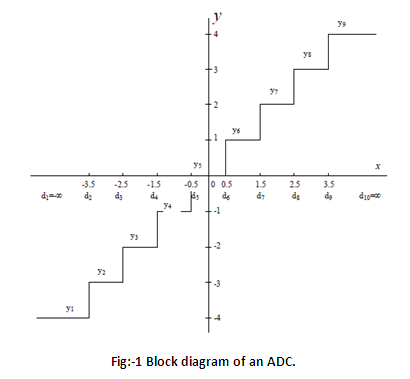

## Introduction

**About the Experiment**

This experiment enables a student to learn

1.How to set the number of levels of a quantizer

2.Calculate the error involved after quantization of the signal.

The principal objective of this experiment is to understand the principle of quantization of continuous-amplitude discrete-time analog signals

## Theory

A discrete time signal is the sampled version of the continuous-time signal, which can theoretically still take on any value within a certain range of values. Thus the next step to convert a discrete-time signal to a digital signal is by restricting the amplitude to certain fixed values from a discrete set. This process is known as quantization and the number of elements in the discrete set is known as the quantization levels. The quantized signal loses information due to rounding-off and thus are only an approximation to the continuous-time signals. The difference between the quantized signal and the continuous amplitude signal is known as quantization noise

A sample input-output characteristic of an uniform quantizer is shown in Fig. 1 
                                    below.

                                
Here y is the continuous amplitude of the signal within the range of [-4,4]. 
                                    Any value less than -4, is mapped to the digit d1. Any value between the range [-4,-3] is mapped to the digit d2.
                                    Any value within the range of [1,2] is mapped to the digit d7. This kind of quantizer is known 
                                    as mid tread quantizer.

                                
Digital systems like computers however do not represent numbers using decimal digits.
                                    Instead they use binary system of representation. Each number there is represented by a binary digit - known as bits.
                                    With 'b' bits, we can represent 2b distinct numbers.

                                
In the above example, the quantized sits at the mid-point of a particular range i.e. [-4, -3]
                                    essentially is represented by a quantized value -3.5, the range [-3, -2] by -2.5 and so on. This
                                    gives rise to error known as quantized error. The number of such ranges available with b bits of quantization is 2b.

                                
Let us define step size i.e. width of each level as Δ.

                                
Let us further define quantization error e(t) = f(t) - fq(t) where the analog signal is f(t) 
                                    and its quantized version is fq(t). Then e(t) lies within the range ±Δ/2. The range of the analog signal that can be covered by
                                    b bits within above error range, R  = 2b.Δ

                                
If the quantization error is uniformly distributed about ±Δ/2 then
$$p(e)=\frac{1}{Δ}|$$
                                
Then Mean Square Error (MSE) for the quantization process, also known as quantization noise power is given by 
$$Nq=\int_ {- \frac{Δ}{2} }^ {+ \frac{Δ}{2}} \frac{1}{Δ} e^2(t)de=\frac{Δ^2}{12}|$$
                                
Now, if the range or maximum excursion of the analog signal is fixed then we can write,
$$Δ=\frac{R}{2^b}|$$
                                
We can see that increasing the value of b or the no. of bits Nq decreases

                                 
Let us further investigate the effect of no. of bits used in quantization by assuming the input
                                    signal is sinusoidal with amplitude A.

$$s=\frac{A^2}{2}|$$
                                
Also, R = 2A thus
$$Δ=\frac{A}{2^{b-1}}|$$
                                
Substituting, Signal to Noise Ratio, SNR = 10 log10 S/N_4= 10log10 (6.22b – 2) ≈ 6.b dB 

                                
Thus each additional bit improves SNR by 6 dB

                             
 
                       

     
 
